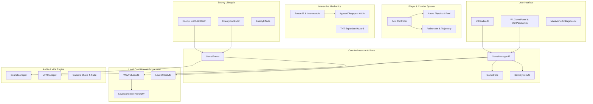
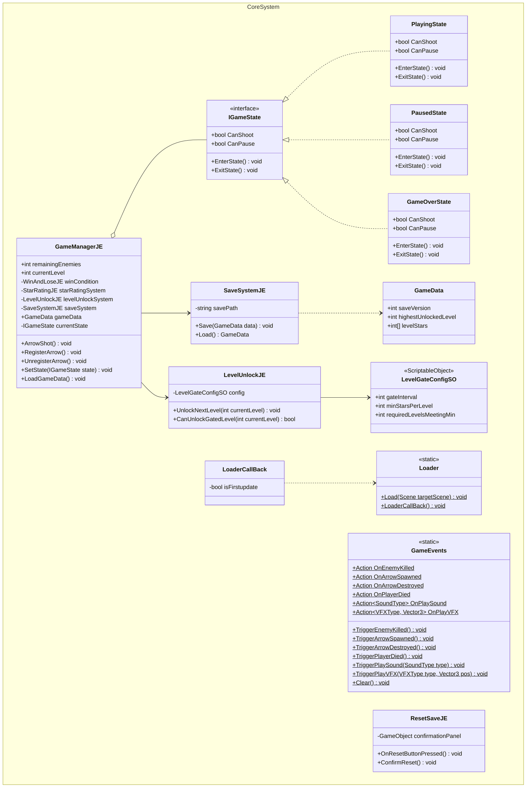
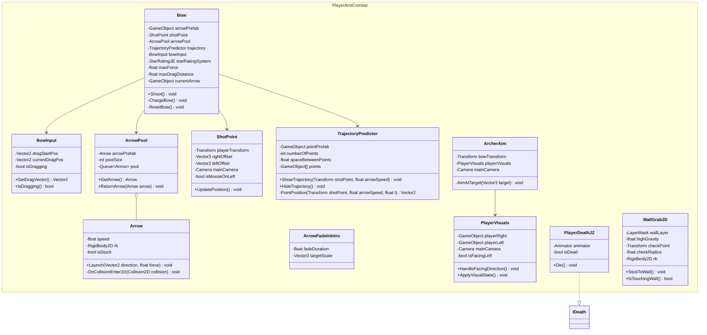
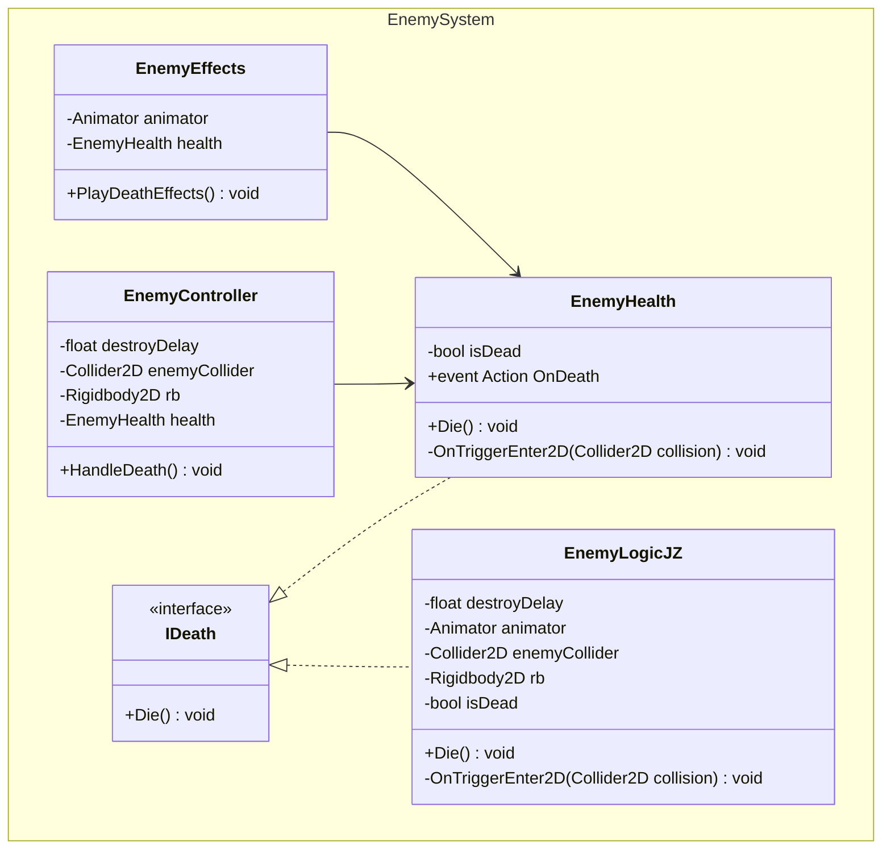
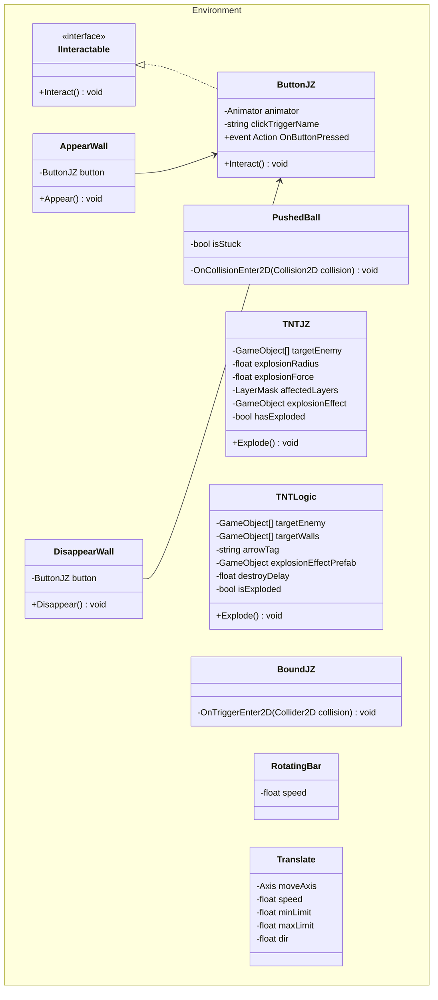
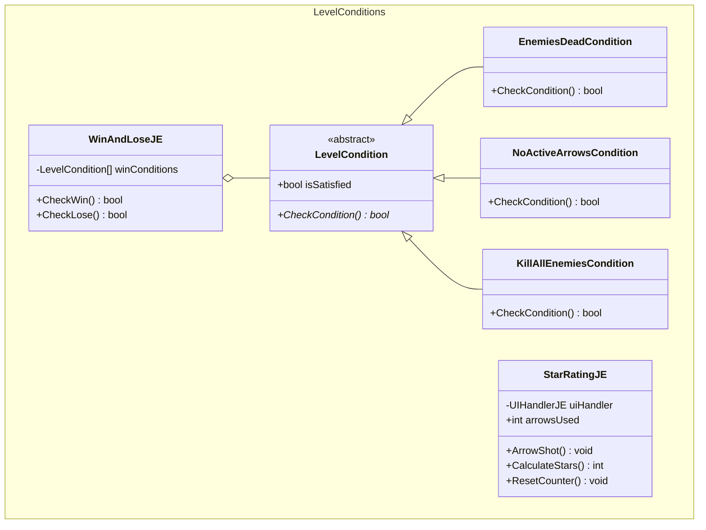
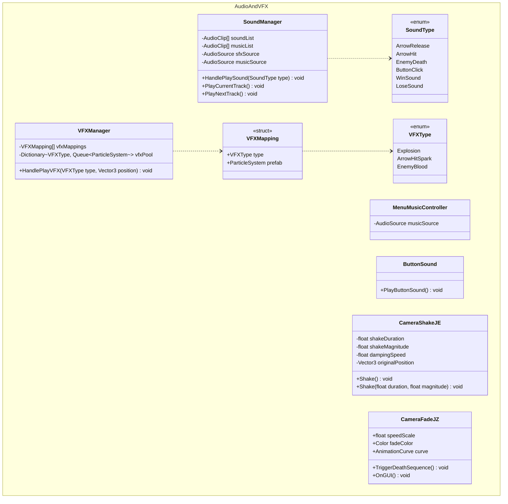

# Matakolnesh - Complete Game Architecture & UML Documentation

This repository contains the source code for the **Matakolnesh!!** 2D physics archery game project in Unity. The project is designed following **SOLID principles**, modular architecture, and industry-standard **Software Design Patterns** to ensure clean separation of concerns, scalability, and 60 FPS performance.

---

## 1. High-Level Subsystem Overview

---

## 2. Core Architecture & Game State Machine

Handles the core game loop, state management (`PlayingState`, `PausedState`, `GameOverState`), static event dispatching (`GameEvents`), scene navigation (`Loader`), and data persistence (`SaveSystemJE`).

---

## 3. Player, Bow & Projectile Physics System

Controls player rotation/aiming, bow tension charging, trajectory parabolic prediction dots, 2D physics movement, and Object Pooling for arrows.

---

## 4. Enemy System & Damage Lifecycle

Defines damage contracts (`IDeath`), hit detection, death sequencing, and particle/sound event triggers on death.

---

## 5. Interactive Environment & Hazard Mechanics

Manages pressure buttons (`IInteractable`), wall toggle triggers, explosive TNT hazards, rolling balls, rotating bar obstacles, and platform translation scripts.

---

## 6. Level Evaluation & Conditions Framework

Implements condition checking strategy for win/loss criteria (`WinAndLoseJE`), abstract level condition classes, and 3-star rating evaluation (`StarRatingJE`).

---

## 7. Audio & Visual Effects Engine

Listens to event channels (`GameEvents`) to play sound effects, manage particle pools, and trigger camera shake/fade effects.

---

## 8. User Interface & Stage Navigation

Controls in-game HUD displays, Win/Lose popups (`WLGamePanelJZ`), star animations (`WinPanelAnimJE`), main menus, and swipeable level selection pages (`StageMenuUIJE`, `SwipeConrolllerJE`).

```mermaid
classDiagram
    namespace UserInterface {
        class UIHandlerJE {
            -TextMeshProUGUI arrowCounter
            +ArrowCounterUpdateJE(int arrowCount) void
        }

        class WLGamePanelJZ {
            -WinPanelAnimJE winPanelAnimation
            -StarUIJZ starUI
            -float winDelay
            -int[] starsRequiredPerTier
            +ShowWin(int earnedStars) void
            +Restart() void
            +StageMenu() void
            +MainMenu() void
            +NextLevelJE() void
        }

        class WinPanelAnimJE {
            -RectTransform[] stars
            -float emptyStarScale
            -float earnedStarPopScale
            -RectTransform winPanel
            +PlayAnimation(int earnedStars) void
        }

        class StarUIJZ {
            -Image[] stars
            -Sprite fullStar
            -Sprite emptyStar
            +DisplayStars(int earnedStars) void
        }

        class PauseSystemJZ {
            -GameObject pauseMenuUI
            +PauseGame() void
            +ResumeGame() void
        }

        class StartInstructionUI {
            -GameObject instructionPanel
            -float time
            -HideInstructions() IEnumerator
        }

        class MainMenuUI {
            +PlayGame() void
            +QuitGame() void
        }

        class MenuUIController {
            +OpenSettings() void
            +CloseSettings() void
        }

        class StageMenuUIJE {
            -GameObject levelButtons
            -LevelsUIJE levelUI
            -Button[] buttons
            +RefreshUI() void
            +OpenLevel(int levelId) void
        }

        class LevelsUIJE {
            +UpdateButtons(Button[] buttons, int unlockedLevel, int[] levelStars) void
        }

        class SwipeConrolllerJE {
            -LTDescr tween
            +NextPage() void
            +PreviousPage() void
            +SetPage(int page) void
            +OnEndDrag(PointerEventData eventData) void
        }

        class ButtonAnimationJE {
            -Vector3 originalScale
        }

        class ButtonAnimaJE {
            -Vector3 originalScale
            -Button button
            +OnPointerEnter(PointerEventData eventData) void
            +OnPointerExit(PointerEventData eventData) void
            +OnPointerDown(PointerEventData eventData) void
            +OnPointerUp(PointerEventData eventData) void
        }

        class GameTestJE {
            -WinAndLoseJE winAndLose
            -StarRatingJE starRating
            -LevelUnlockJE levelUnlock
            -SaveSystemJE saveSystem
            -GameManagerJE gameManager
            +TestWin() void
            +TestLose() void
            +GiveMaxStars() void
        }
    }

    WLGamePanelJZ --> WinPanelAnimJE
    WLGamePanelJZ --> StarUIJZ
    StageMenuUIJE --> LevelsUIJE
    GameTestJE --> GameManagerJE
```

---

## 9. Applied Software Design Patterns

1. **State Pattern:** Encapsulates core game states (`PlayingState`, `PausedState`, `GameOverState`) behind the `IGameState` interface. This eliminates monolithic switch/case blocks and ensures safe state transitions.
2. **Strategy Pattern:** Implemented for win condition checking. `WinAndLoseJE` checks an array of injected `LevelCondition` strategies (e.g. `EnemiesDeadCondition`, `NoActiveArrowsCondition`), strictly respecting the Open/Closed Principle (OCP).
3. **Observer Pattern (Event Bus):** Handled via `GameEvents.cs`. Entities dispatch C# `Action` delegates (`OnEnemyKilled`, `OnPlayVFX`, `OnPlaySound`) to keep systems decoupled.
4. **Object Pool Pattern:** Managed by `ArrowPool` and `VFXManager` to recycle arrow instances and particle effects, reducing garbage collection overhead.
5. **Singleton Pattern:** Used for global coordinators (`GameManagerJE`, `SoundManager`), decoupled from gameplay objects via the Event Bus.
6. **Command / Interactable Pattern:** Managed through `IInteractable` allowing buttons and switches (`ButtonJZ`) to trigger environment components (`AppearWall`, `DisappearWall`, `TNTJZ`).

---

## 10. Complete Script Directory

- **Core & State Machine:**
  - [`Assets/Scripts/GameManagerJE.cs`](./Assets/Scripts/GameManagerJE.cs)
  - [`Assets/Scripts/Core/GameEvents.cs`](./Assets/Scripts/Core/GameEvents.cs)
  - [`Assets/Scripts/States/IGameState.cs`](./Assets/Scripts/States/IGameState.cs)
  - [`Assets/Scripts/States/PlayingState.cs`](./Assets/Scripts/States/PlayingState.cs)
  - [`Assets/Scripts/States/PausedState.cs`](./Assets/Scripts/States/PausedState.cs)
  - [`Assets/Scripts/States/GameOverState.cs`](./Assets/Scripts/States/GameOverState.cs)
  - [`Assets/Scripts/SaveSystemJE.cs`](./Assets/Scripts/SaveSystemJE.cs)
  - [`Assets/Scripts/GameDataJE.cs`](./Assets/Scripts/GameDataJE.cs)
  - [`Assets/Scripts/ResetSaveJE.cs`](./Assets/Scripts/ResetSaveJE.cs)
  - [`Assets/Scripts/Loader.cs`](./Assets/Scripts/Loader.cs)
  - [`Assets/Scripts/LoaderCallBack.cs`](./Assets/Scripts/LoaderCallBack.cs)
  - [`Assets/Scripts/LevelGateConfigSO.cs`](./Assets/Scripts/LevelGateConfigSO.cs)
  - [`Assets/Scripts/LevelUnlockJE.cs`](./Assets/Scripts/LevelUnlockJE.cs)
  - [`Assets/Scripts/UnlockFiveLevels.cs`](./Assets/Scripts/UnlockFiveLevels.cs)

- **Combat & Player Mechanics:**
  - [`Assets/Scripts/Bow.cs`](./Assets/Scripts/Bow.cs)
  - [`Assets/Scripts/BowInput.cs`](./Assets/Scripts/BowInput.cs)
  - [`Assets/Scripts/NewPlayer/ArcherAim.cs`](./Assets/Scripts/NewPlayer/ArcherAim.cs)
  - [`Assets/Scripts/ShotPoint.cs`](./Assets/Scripts/ShotPoint.cs)
  - [`Assets/Scripts/Trajectory.cs`](./Assets/Scripts/Trajectory.cs)
  - [`Assets/Scripts/Arrow.cs`](./Assets/Scripts/Arrow.cs)
  - [`Assets/Scripts/ArrowPool.cs`](./Assets/Scripts/ArrowPool.cs)
  - [`Assets/Scripts/ArrowTween.cs`](./Assets/Scripts/ArrowTween.cs)
  - [`Assets/Scripts/PlayerVisuals.cs`](./Assets/Scripts/PlayerVisuals.cs)
  - [`Assets/Scripts/PlayerDeathJZ.cs`](./Assets/Scripts/PlayerDeathJZ.cs)
  - [`Assets/Scripts/WallGrab2D.cs`](./Assets/Scripts/WallGrab2D.cs)

- **Enemy Lifecycle:**
  - [`Assets/Scripts/IDeathJZ.cs`](./Assets/Scripts/IDeathJZ.cs)
  - [`Assets/Scripts/EnemyHealth.cs`](./Assets/Scripts/EnemyHealth.cs)
  - [`Assets/Scripts/EnemyController.cs`](./Assets/Scripts/EnemyController.cs)
  - [`Assets/Scripts/EnemyEffects.cs`](./Assets/Scripts/EnemyEffects.cs)
  - [`Assets/Scripts/EnemyLogicJZ.cs`](./Assets/Scripts/EnemyLogicJZ.cs)

- **Interactive Environment:**
  - [`Assets/Scripts/ButtonWire/IInteractable.cs`](./Assets/Scripts/ButtonWire/IInteractable.cs)
  - [`Assets/Scripts/ButtonWire/ButtonJZ.cs`](./Assets/Scripts/ButtonWire/ButtonJZ.cs)
  - [`Assets/Scripts/ButtonWire/AppearWall.cs`](./Assets/Scripts/ButtonWire/AppearWall.cs)
  - [`Assets/Scripts/ButtonWire/DisappearWall.cs`](./Assets/Scripts/ButtonWire/DisappearWall.cs)
  - [`Assets/Scripts/ButtonWire/PushedBall.cs`](./Assets/Scripts/ButtonWire/PushedBall.cs)
  - [`Assets/Scripts/ButtonWire/TNTJZ.cs`](./Assets/Scripts/ButtonWire/TNTJZ.cs)
  - [`Assets/Scripts/TNT.cs`](./Assets/Scripts/TNT.cs)
  - [`Assets/Scripts/BoundJZ.cs`](./Assets/Scripts/BoundJZ.cs)
  - [`Assets/Scripts/RotatingBar/RotatingBar.cs`](./Assets/Scripts/RotatingBar/RotatingBar.cs)
  - [`Assets/Scripts/Translate/Translate.cs`](./Assets/Scripts/Translate/Translate.cs)

- **Level Conditions & Rules:**
  - [`Assets/Scripts/Conditions/LevelCondition.cs`](./Assets/Scripts/Conditions/LevelCondition.cs)
  - [`Assets/Scripts/Conditions/EnemiesDeadCondition.cs`](./Assets/Scripts/Conditions/EnemiesDeadCondition.cs)
  - [`Assets/Scripts/Conditions/NoActiveArrowsCondition.cs`](./Assets/Scripts/Conditions/NoActiveArrowsCondition.cs)
  - [`Assets/Scripts/Conditions/KillAllEnemiesCondition.cs`](./Assets/Scripts/Conditions/KillAllEnemiesCondition.cs)
  - [`Assets/Scripts/WinAndLoseJE.cs`](./Assets/Scripts/WinAndLoseJE.cs)
  - [`Assets/Scripts/StarRatingJE.cs`](./Assets/Scripts/StarRatingJE.cs)

- **Audio & Visual Effects:**
  - [`Assets/Scripts/Core/VFXManager.cs`](./Assets/Scripts/Core/VFXManager.cs)
  - [`Assets/Scripts/SoundManager.cs`](./Assets/Scripts/SoundManager.cs)
  - [`Assets/Scripts/MenuMusicController.cs`](./Assets/Scripts/MenuMusicController.cs)
  - [`Assets/Scripts/ButtonSound.cs`](./Assets/Scripts/ButtonSound.cs)
  - [`Assets/Scripts/CameraShakeJE.cs`](./Assets/Scripts/CameraShakeJE.cs)
  - [`Assets/Scripts/CameraFadeJZ.cs`](./Assets/Scripts/CameraFadeJZ.cs)

- **User Interface & Stage Navigation:**
  - [`Assets/Scripts/UIHandlerJE.cs`](./Assets/Scripts/UIHandlerJE.cs)
  - [`Assets/Scripts/WLGamePanelJZ.cs`](./Assets/Scripts/WLGamePanelJZ.cs)
  - [`Assets/Scripts/WinPanelAnimJE.cs`](./Assets/Scripts/WinPanelAnimJE.cs)
  - [`Assets/Scripts/StarUIJZ.cs`](./Assets/Scripts/StarUIJZ.cs)
  - [`Assets/Scripts/PauseSystemJZ.cs`](./Assets/Scripts/PauseSystemJZ.cs)
  - [`Assets/Scripts/StartInstructionUI.cs`](./Assets/Scripts/StartInstructionUI.cs)
  - [`Assets/Scripts/MainMenuUi.cs`](./Assets/Scripts/MainMenuUi.cs)
  - [`Assets/Scripts/MainmenuController.cs`](./Assets/Scripts/MainmenuController.cs)
  - [`Assets/Scripts/StageMenuScripts/StageMenuUIJE.cs`](./Assets/Scripts/StageMenuScripts/StageMenuUIJE.cs)
  - [`Assets/Scripts/StageMenuScripts/LevelsUIJE.cs`](./Assets/Scripts/StageMenuScripts/LevelsUIJE.cs)
  - [`Assets/Scripts/StageMenuScripts/SwipeConrolllerJE.cs`](./Assets/Scripts/StageMenuScripts/SwipeConrolllerJE.cs)
  - [`Assets/Scripts/StageMenuScripts/ButtonAnimationJE.cs`](./Assets/Scripts/StageMenuScripts/ButtonAnimationJE.cs)
  - [`Assets/Scripts/ButtonAnimJE.cs`](./Assets/Scripts/ButtonAnimJE.cs)
  - [`Assets/Scripts/GameTestJE.cs`](./Assets/Scripts/GameTestJE.cs)
