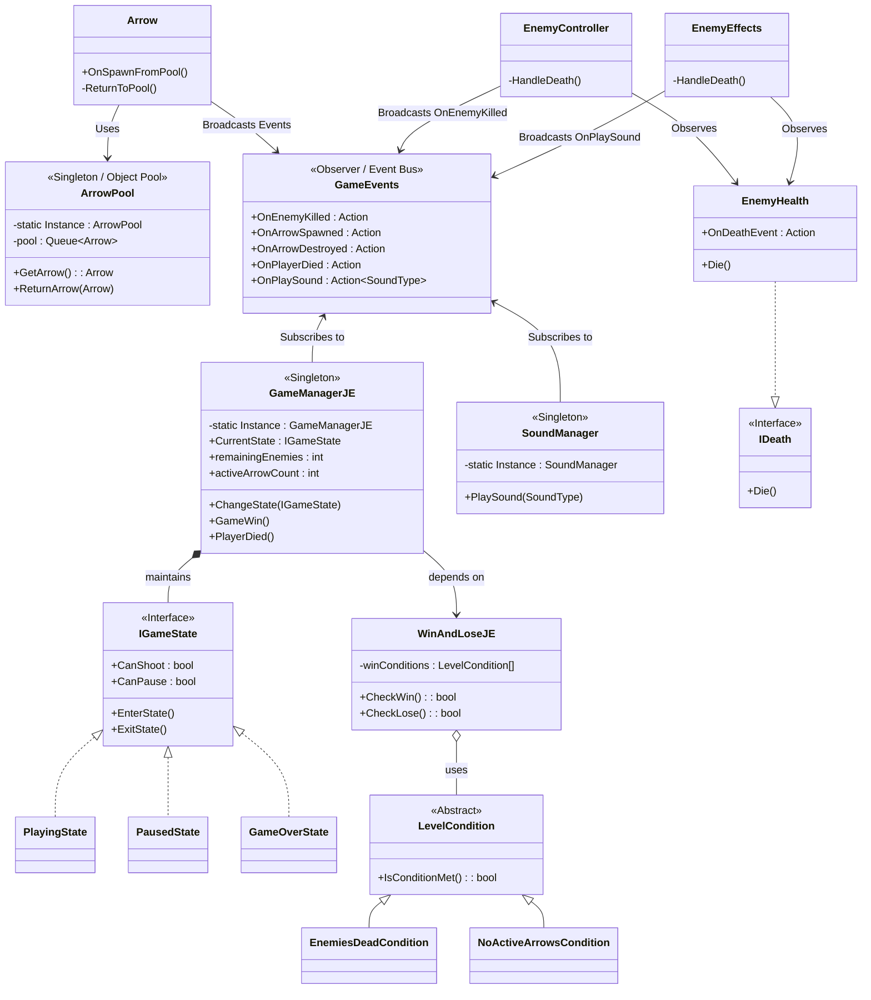

# Matakolnesh - Game Architecture

This repository contains the source code for the "Matakolnesh!!" game project. The architecture has been carefully designed to adhere to **SOLID principles** and utilizes several professional **Software Design Patterns** to ensure scalability, clean communication between systems, and high performance.

## System Architecture & Design Patterns (UML)

The following UML Class Diagram maps out the core systems, their relationships, and highlights the design patterns implemented in this project.

## Applied Design Patterns

1. **State Pattern:** Encapsulates the core game state (`PlayingState`, `PausedState`, `GameOverState`) behind the `IGameState` interface. This eliminates bulky conditional logic and ensures secure state transitions.
2. **Strategy Pattern:** Used for dynamic win conditions. `WinAndLoseJE` evaluates an array of injected `LevelCondition` strategies (e.g., `EnemiesDeadCondition`), completely satisfying the Open/Closed Principle (OCP).
3. **Observer Pattern (Event Bus):** Handled via `GameEvents.cs`. Gameplay entities broadcast events (using C# `Action` delegates) instead of calling singletons directly. This resolves Dependency Inversion (DIP) violations.
4. **Object Pool Pattern:** Managed by `ArrowPool`. Pre-instantiates and recycles arrow projectiles to prevent memory allocation spikes and maintain 60 FPS.
5. **Singleton Pattern:** Used responsibly for global access points (`GameManagerJE`, `SoundManager`), though decoupled from actual gameplay actors via the Event Bus.
